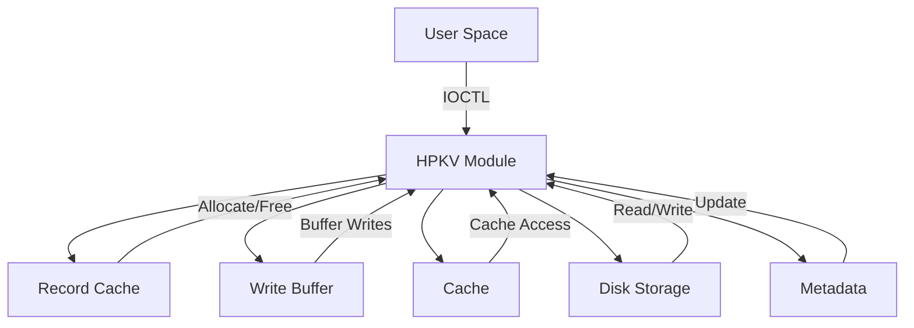
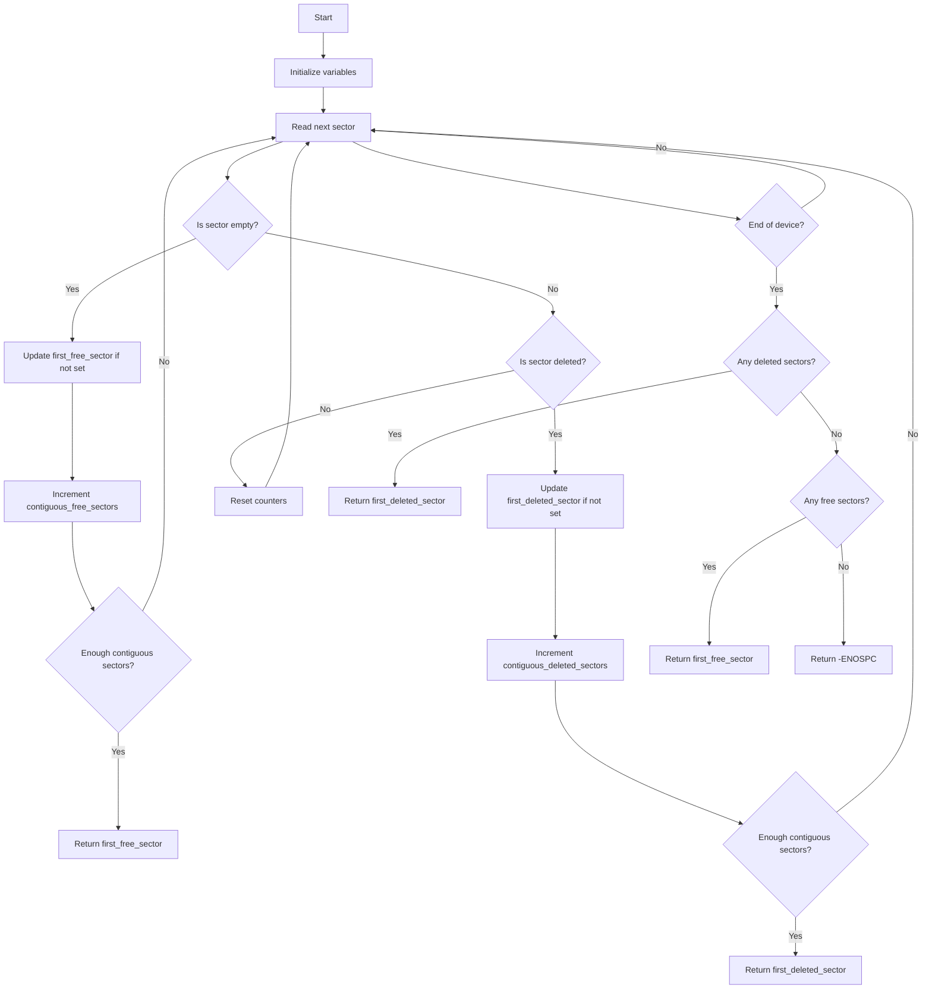
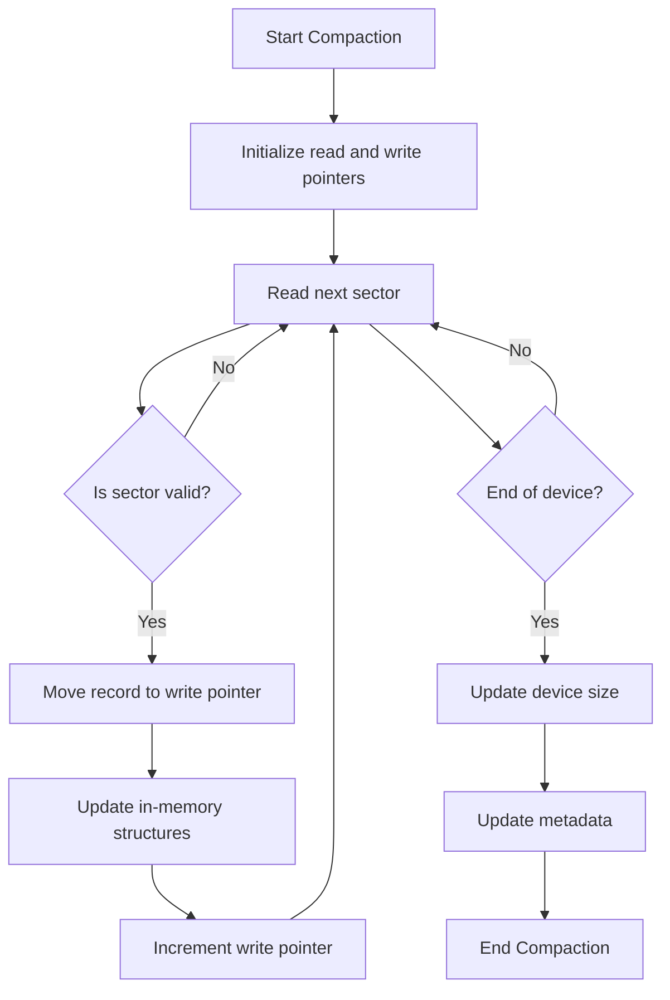
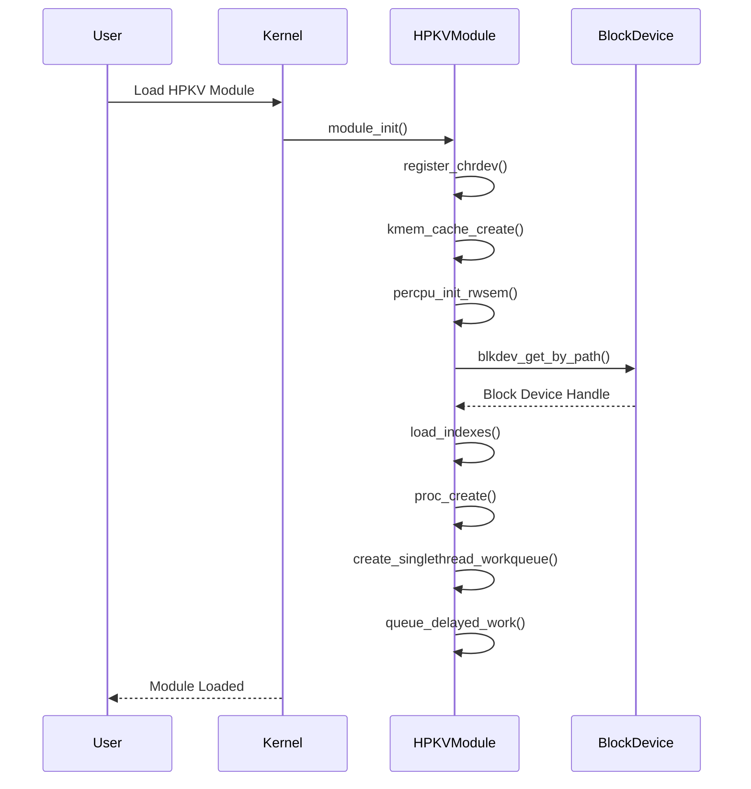
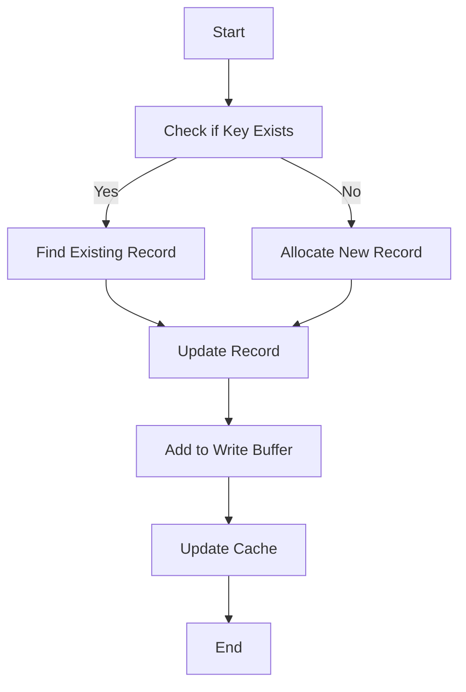
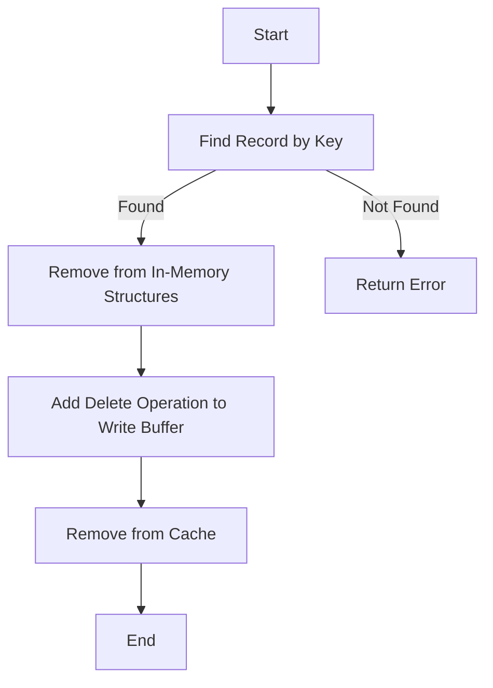
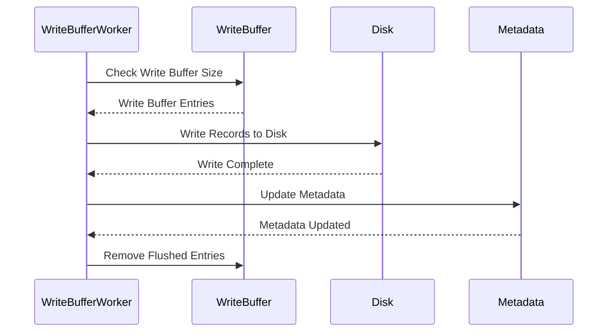
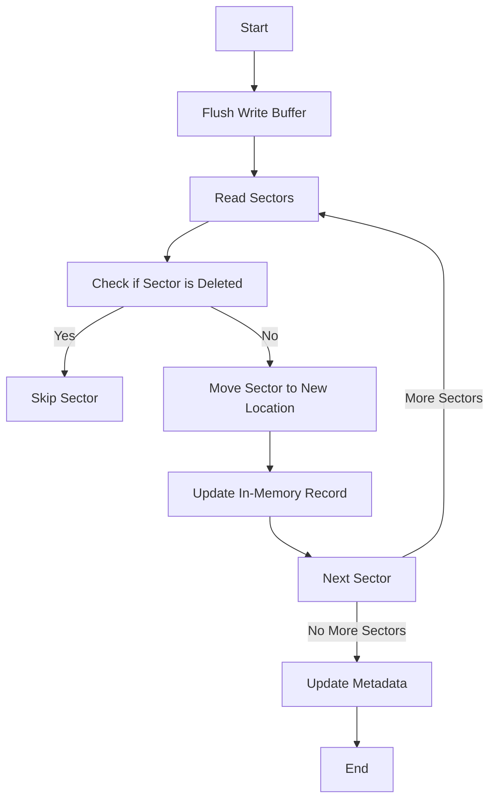
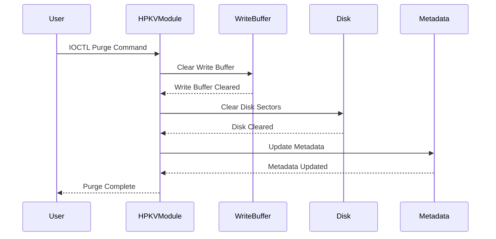

# HPKV Module Technical Design Document

## Table of Contents
1. [Introduction](#introduction)
2. [High-Level Architecture](#high-level-architecture)
3. [Data Structures](#data-structures)
    - [Record Structure](#record-structure)
    - [Cached Record Structure](#cached-record-structure)
    - [Write Buffer Entry Structure](#write-buffer-entry-structure)
    - [HPKV Metadata Structure](#hpkv-metadata-structure)
4. [Memory Management](#memory-management)
    - [Record Cache](#record-cache)
    - [Write Buffer](#write-buffer)
    - [Cache](#cache)
    - [Memory Allocation Techniques](#memory-allocation-techniques)
    - [Synchronization and Locking Mechanisms](#synchronization-and-locking-mechanisms)
5. [Disk Operations](#disk-operations)
    - [Sector Management](#sector-management)
    - [Metadata Management](#metadata-management)
6. [Code Flows](#code-flows)
    - [Initialization](#initialization)
    - [Record Insertion/Update](#record-insertionupdate)
    - [Record Deletion](#record-deletion)
    - [Write Buffer Flush](#write-buffer-flush)
    - [Disk Compaction](#disk-compaction)
    - [Purge Operation](#purge-operation)
    - [Device IOCTL](#device-ioctl)
7. [Diagrams](#diagrams)
    - [Sequence Diagrams](#sequence-diagrams)
    - [Flowcharts](#flowcharts)
    - [SVG Visualizations](#svg-visualizations)

## Introduction
The HPKV (High Performance Key-Value) store kernel module is designed to provide a high-performance, persistent key-value store within the Linux kernel. This document provides a comprehensive technical design of the HPKV module, detailing its data structures, memory management, disk operations, and various code flows.

## High-Level Architecture
The HPKV module consists of several key components that work together to provide a high-performance key-value store. These components include:

1. **Record Cache**: A slab cache used to allocate and free `record` structures efficiently.
2. **Write Buffer**: A linked list of `write_buffer_entry` structures used to buffer write operations before flushing them to disk.
3. **Cache**: An in-memory hash table of `cached_record` structures used to cache frequently accessed key-value pairs.
4. **Disk Storage**: The persistent storage where key-value pairs are stored on disk.
5. **Metadata**: The metadata stored on disk that includes information about the total number of records, total size, and version.

The following diagram provides a high-level overview of the HPKV module's architecture:

**High-Level Architecture Diagram:**


## Data Structures

### Record Structure
The `record` structure represents a key-value pair stored in memory and on disk. It includes fields for the key, value, value length, and various pointers for hash table and red-black tree management.

**Structure Definition:**
```c
struct record {
    char key[MAX_KEY_SIZE];
    char *value;
    size_t value_len;
    struct hlist_node hash_node;
    struct rb_node tree_node;
    struct rcu_head rcu;
    struct llist_node list_node;
    sector_t sector;
    atomic_t refcount;
};
```

### Cached Record Structure
The `cached_record` structure represents a key-value pair stored in the in-memory cache. It includes fields for the key, value, value length, and sector.

**Structure Definition:**
```c
struct cached_record {
    char key[MAX_KEY_SIZE];
    char *value;
    size_t value_len;
    sector_t sector;
    struct hlist_node node;
};
```

### Write Buffer Entry Structure
The `write_buffer_entry` structure represents an entry in the write buffer. It includes fields for the operation type (insert, update, delete), the record, and the old value length.

**Structure Definition:**
```c
struct write_buffer_entry {
    enum operation_type op;
    struct record *record;
    size_t old_value_len;
    struct list_head list;
};
```

### HPKV Metadata Structure
The `hpkv_metadata` structure represents the metadata stored on disk. It includes fields for the signature, total records, total size, and version.

**Structure Definition:**
```c
struct hpkv_metadata {
    char signature[HPKV_SIGNATURE_SIZE];
    uint64_t total_records;
    uint64_t total_size;
    uint32_t version;
};
```

## Memory Management

### Record Cache
The record cache is a slab cache used to allocate and free `record` structures efficiently. It is created using `kmem_cache_create` and destroyed using `kmem_cache_destroy`.

**Initialization:**
```c
record_cache = kmem_cache_create("hpkv_record", sizeof(struct record), 0, SLAB_HWCACHE_ALIGN | SLAB_PANIC, NULL);
```

**Destruction:**
```c
kmem_cache_destroy(record_cache);
```

### Write Buffer
The write buffer is a linked list of `write_buffer_entry` structures. It is protected by a spinlock and a wait queue is used to wake up the write buffer worker thread.

**Initialization:**
```c
INIT_LIST_HEAD(&write_buffer);
spin_lock_init(&write_buffer_lock);
init_waitqueue_head(&write_buffer_wait);
```

### Cache
The cache is a hash table of `cached_record` structures. It is protected by a spinlock and has a maximum size defined by `CACHE_SIZE`.

**Initialization:**
```c
DEFINE_HASHTABLE(cache, 10);  // 1024 buckets
static int cache_count = 0;
static DEFINE_SPINLOCK(cache_lock);
```

### Memory Allocation Techniques
The HPKV module uses various memory allocation techniques to manage memory efficiently. These techniques include slab allocation, kmalloc, and vmalloc.

#### Slab Allocation
Slab allocation is used for frequently allocated and deallocated objects, such as `record` structures. The slab allocator provides efficient memory management by reducing fragmentation and reusing memory.

**Example:**
```c
record_cache = kmem_cache_create("hpkv_record", sizeof(struct record), 0, SLAB_HWCACHE_ALIGN | SLAB_PANIC, NULL);
```

#### kmalloc
`kmalloc` is used for allocating memory for variable-sized objects, such as the value field in the `record` structure. `kmalloc` provides memory allocation from the kernel's general-purpose memory pool.

**Example:**
```c
new_record->value = kmalloc(value_len + 1, GFP_KERNEL);
```

#### vmalloc
`vmalloc` is used for allocating large contiguous memory regions, such as buffers for disk operations. `vmalloc` allocates memory from the kernel's virtual address space, which may not be physically contiguous.

**Example:**
```c
buffer = vmalloc(BLOCK_SIZE);
```

### Synchronization and Locking Mechanisms
The HPKV module employs various synchronization and locking mechanisms to ensure data integrity and consistency in a concurrent environment. These mechanisms include:

#### Read-Copy Update (RCU)
RCU is used for read-mostly data structures, such as the hash table of records (`kv_store`). RCU allows readers to access data without locking, while updates are performed in a way that ensures readers see a consistent view of the data.

**Example:**
```c
rcu_read_lock();
hash_for_each_possible_rcu(kv_store, record, hash_node, hash) {
    if (strcmp(record->key, key) == 0) {
        rcu_read_unlock();
        return record;
    }
}
rcu_read_unlock();
```

**Details:**
- **Readers:** RCU readers use `rcu_read_lock()` and `rcu_read_unlock()` to mark the beginning and end of a read-side critical section. This ensures that the data they are accessing remains consistent during the read operation.
- **Writers:** RCU writers use `synchronize_rcu()` to wait for all ongoing RCU read-side critical sections to complete before making changes to the data. This ensures that readers see a consistent view of the data.
- **Grace Period:** RCU provides a grace period during which updates can be made safely. After the grace period, the old data can be freed using `call_rcu()`.

#### Per-CPU Read-Write Semaphores
Per-CPU read-write semaphores (`percpu_rw_semaphore`) are used to protect critical sections that require read-write synchronization. Readers acquire the semaphore in read mode, while writers acquire it in write mode, ensuring mutual exclusion.

**Example:**
```c
percpu_down_read(&rw_sem);
// Critical section for readers
percpu_up_read(&rw_sem);

percpu_down_write(&rw_sem);
// Critical section for writers
percpu_up_write(&rw_sem);
```

**Details:**
- **Readers:** Readers use `percpu_down_read()` and `percpu_up_read()` to acquire and release the read lock. Multiple readers can acquire the read lock simultaneously.
- **Writers:** Writers use `percpu_down_write()` and `percpu_up_write()` to acquire and release the write lock. Only one writer can acquire the write lock at a time, and it has exclusive access to the critical section.

#### Spinlocks
Spinlocks are used to protect short critical sections that require mutual exclusion. Spinlocks are efficient for protecting data structures like the write buffer and cache, where the critical sections are short and contention is low.

**Example:**
```c
spin_lock(&write_buffer_lock);
// Critical section
spin_unlock(&write_buffer_lock);
```

**Details:**
- **Locking:** Spinlocks use `spin_lock()` and `spin_unlock()` to acquire and release the lock. Spinlocks are busy-wait locks, meaning that the CPU will spin in a loop until the lock is acquired.
- **Interrupts:** Spinlocks can be used with interrupts disabled to prevent deadlocks. This is done using `spin_lock_irqsave()` and `spin_unlock_irqrestore()`.

#### Wait Queues
Wait queues are used to synchronize threads that need to wait for certain conditions to be met. In the HPKV module, a wait queue is used to wake up the write buffer worker thread when there are entries to be processed.

**Example:**
```c
wait_event_interruptible(write_buffer_wait, !list_empty(&write_buffer) || write_buffer_exit);
```

**Details:**
- **Waiting:** Threads use `wait_event_interruptible()` to wait for a condition to be met. The condition is checked periodically, and the thread is put to sleep if the condition is not met.
- **Waking Up:** Threads use `wake_up()` to wake up all threads waiting on the wait queue. This is done when the condition is met, such as when new entries are added to the write buffer.

#### Kernel Threads
Kernel threads are used for background tasks that need to run independently of user processes. The HPKV module uses a kernel thread for the write buffer worker, which processes write buffer entries and flushes them to disk.

**Example:**
```c
write_buffer_thread = kthread_run(write_buffer_worker, NULL, "hpkv_write_buffer");
```

**Details:**
- **Creation:** Kernel threads are created using `kthread_run()`, which starts the thread and runs the specified function.
- **Stopping:** Kernel threads can be stopped using `kthread_stop()`, which signals the thread to exit and waits for it to complete.

#### Timers and Workqueues
Timers and workqueues are used for deferred and periodic tasks. The HPKV module uses a delayed workqueue for disk compaction, which runs periodically to optimize disk usage.

**Example:**
```c
INIT_DELAYED_WORK(&compact_work, compact_work_handler);
queue_delayed_work(compact_wq, &compact_work, COMPACT_INTERVAL);
```

**Details:**
- **Workqueues:** Workqueues are used to schedule work to be performed later. This is done using `INIT_DELAYED_WORK()` to initialize the work and `queue_delayed_work()` to schedule it.
- **Timers:** Timers are used to schedule work to be performed after a certain interval. This is done using `mod_timer()` to set the timer and `del_timer_sync()` to delete it.

By using these synchronization and locking mechanisms, the HPKV module ensures data integrity and consistency while maintaining high performance in a concurrent environment.

## Disk Operations

### Sector Management

The HPKV module manages disk sectors efficiently to store and retrieve key-value pairs. The process involves several key operations:

#### Finding Free Sectors

The `find_free_sector` function is crucial for disk management. Here's a detailed flowchart of how it works:



1. The function starts by initializing variables to track free and deleted sectors.
2. It then reads sectors sequentially from the beginning of the device.
3. For each sector:
   - If it's empty (all zeros), it's considered free.
   - If it starts with "\0DELETED", it's considered a deleted sector.
   - Otherwise, it's an occupied sector.
4. The function keeps track of contiguous free and deleted sectors.
5. If enough contiguous sectors are found (based on the required size), the function returns the starting sector.
6. If the end of the device is reached without finding enough contiguous sectors:
   - It first checks for any deleted sectors that can be reused.
   - If no deleted sectors are available, it checks for any free sectors.
   - If no suitable space is found, it returns -ENOSPC to indicate that the device is full.

#### Record Insertion

When inserting a new record:

1. The `find_free_sector` function is called to locate suitable space.
2. If no space is found, the device is extended using `extend_device`.
3. The record is written to the disk using `write_record_to_disk`:
   - Key, value length, and value are written to the sector.
   - If the record spans multiple sectors, additional sectors are used.

#### Record Update

Updating a record follows a similar process to insertion:

1. The old record is marked as deleted in memory.
2. A new sector is found for the updated record.
3. The updated record is written to the new sector.
4. The old sector is marked as deleted on disk.

#### Record Deletion

When deleting a record:

1. The record is removed from in-memory structures.
2. The sector on disk is marked as deleted by writing "\0DELETED" at the beginning.
3. This sector becomes available for future use.

#### Purge Operation

The purge operation clears all data from the device:

1. All in-memory structures (hash table, red-black tree, cache) are cleared.
2. The write buffer is flushed and cleared.
3. All sectors on the disk are marked as deleted.
4. Metadata is updated to reflect an empty device.

#### Disk Compaction

Disk compaction is performed periodically to optimize disk usage:

1. The process starts from the beginning of the device.
2. Valid records are moved to the front of the device.
3. Deleted and empty sectors are consolidated at the end.
4. In-memory structures are updated to reflect new sector locations.
5. The device size is potentially reduced if significant space is freed.

Here's a flowchart of the disk compaction process:



### Metadata Management

Metadata is crucial for maintaining the integrity and state of the HPKV store. The `hpkv_metadata` structure contains:

- Signature: To identify HPKV-formatted devices
- Total records: Number of records in the store
- Total size: Total size of all records
- Version: Version of the HPKV format

Metadata is updated in the following scenarios:

1. **Initialization**: When a new device is initialized, metadata is written with initial values.

2. **Record Operations**: After each write buffer flush, metadata is updated to reflect changes in record count and total size.

3. **Purge Operation**: Metadata is reset to reflect an empty device.

4. **Disk Compaction**: After compaction, metadata is updated to reflect the new device size and record count.

5. **Device Extension**: When the device is extended, metadata is updated with the new size.

The `update_metadata` function is responsible for writing the current state to the metadata sector (sector 0) on the disk. This ensures that the on-disk state is always consistent with the in-memory state after significant operations.

### Device Extension

When the device runs out of space:

1. The `extend_device` function is called.
2. It attempts to increase the device size by a predefined amount (EXTENSION_SIZE).
3. If successful, the new size is reflected in the metadata.
4. The device can now accommodate more records.

This dynamic extension allows the HPKV store to grow as needed, up to a maximum defined size (MAX_DEVICE_SIZE).

By managing these disk operations efficiently, the HPKV module ensures optimal use of disk space, fast record access, and the ability to handle large datasets while maintaining data integrity.

### High Level Disk Structure


## Code Flows

### Initialization
The initialization flow involves registering the character device, creating the record cache, opening the block device, and loading indexes from disk.

**Initialization Sequence Diagram:**


### Record Insertion/Update
The record insertion/update flow involves finding or creating a record, updating in-memory structures, adding the record to the write buffer, and updating the cache.

**Record Insertion/Update Flowchart:**


### Record Deletion
The record deletion flow involves finding the record, removing it from in-memory structures, adding a delete operation to the write buffer, and removing the record from the cache.

**Record Deletion Flowchart:**


### Write Buffer Flush
The write buffer flush flow involves processing entries in the write buffer, writing records to disk, and updating metadata.

**Write Buffer Flush Sequence Diagram:**


### Disk Compaction
The disk compaction flow involves flushing the write buffer, compacting records on disk, and updating metadata.

**Disk Compaction Flowchart:**


### Purge Operation
The purge operation flow involves clearing in-memory structures, clearing the write buffer, and clearing the disk.

**Purge Operation Sequence Diagram:**


### Device IOCTL
The device IOCTL flow involves handling various commands such as get by key, delete by key, partial update, and purge.

**Device IOCTL Flowchart:**

