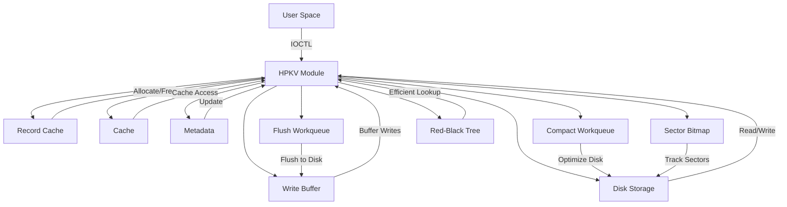
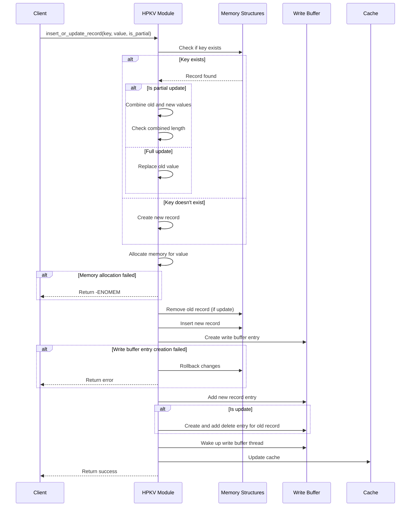
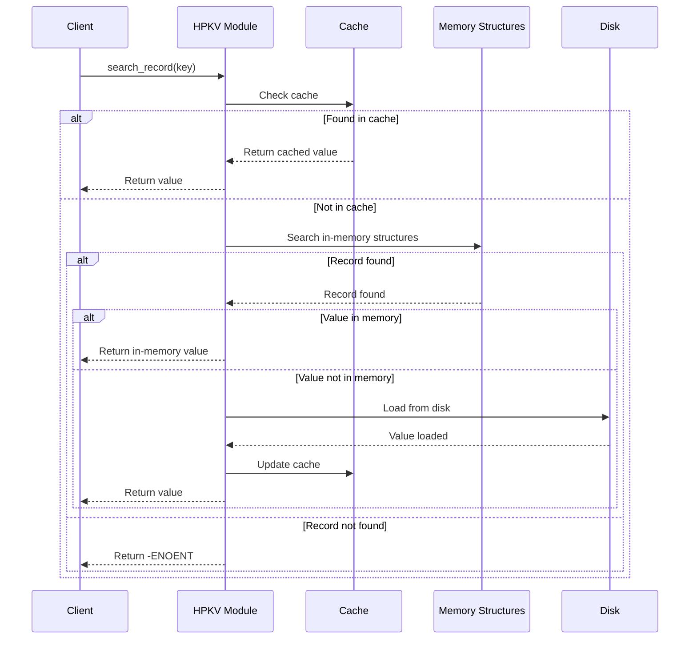
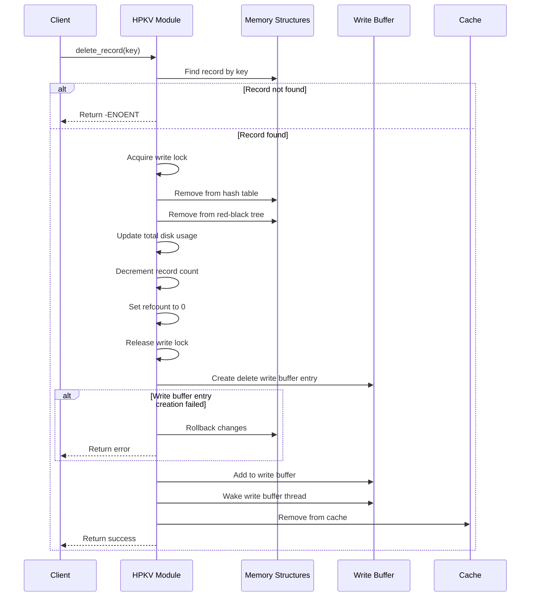
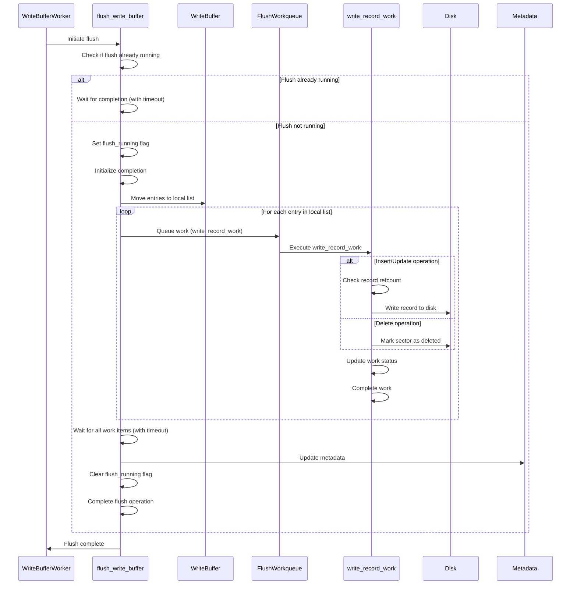

# HPKV Module Technical Design Document

## Table of Contents
1. [Introduction](#introduction)
2. [High-Level Architecture](#high-level-architecture)
3. [Data Structures](#data-structures)
    - [Record Structure](#record-structure)
    - [Cached Record Structure](#cached-record-structure)
    - [Write Buffer Entry Structure](#write-buffer-entry-structure)
    - [HPKV Metadata Structure](#hpkv-metadata-structure)
4. [Memory Management](#memory-management)
    - [Record Cache](#record-cache)
    - [Write Buffer](#write-buffer)
    - [Cache](#cache)
    - [Memory Allocation Techniques](#memory-allocation-techniques)
    - [Synchronization and Locking Mechanisms](#synchronization-and-locking-mechanisms)
5. [Disk Operations](#disk-operations)
    - [Sector Management](#sector-management)
    - [Metadata Management](#metadata-management)
    - [Device Extension](#device-extension)
6. [Code Flows](#code-flows)
    - [Initialization](#initialization)
    - [Record Insertion/Update](#record-insertionupdate)
    - [Record Deletion](#record-deletion)
    - [Write Buffer Flush](#write-buffer-flush)
    - [Disk Compaction](#disk-compaction)
    - [Purge Operation](#purge-operation)
    - [Device IOCTL](#device-ioctl)
7. [Logging and Debugging](#logging-and-debugging)
8. [Module Parameters](#module-parameters)
9. [Diagrams](#diagrams)
    - [Sequence Diagrams](#sequence-diagrams)
    - [Flowcharts](#flowcharts)
    - [SVG Visualizations](#svg-visualizations)

## Introduction
The HPKV (High Performance Key-Value) store kernel module is designed to provide a high-performance, persistent key-value store within the Linux kernel. This document provides a comprehensive technical design of the HPKV module, detailing its data structures, memory management, disk operations, and various code flows.

## High-Level Architecture
The HPKV module consists of several key components that work together to provide a high-performance key-value store. These components include:

1. **Record Cache**: A slab cache used to allocate and free `record` structures efficiently.
2. **Write Buffer**: A linked list of `write_buffer_entry` structures used to buffer write operations before flushing them to disk.
3. **Cache**: An in-memory hash table of `cached_record` structures used to cache frequently accessed key-value pairs.
4. **Disk Storage**: The persistent storage where key-value pairs are stored on disk.
5. **Metadata**: The metadata stored on disk that includes information about the total number of records, total size, device size, and version.
6. **Workqueues**: Separate workqueues for flushing the write buffer and performing disk compaction.
7. **Bitmap**: A bitmap to track allocated sectors on the disk.
8. **Red-Black Tree**: An in-memory red-black tree for efficient key-based lookups.

The following diagram provides a high-level overview of the HPKV module's architecture:

**High-Level Architecture Diagram:**


## Data Structures

### Record Structure
The `record` structure represents a key-value pair stored in memory and on disk. It includes fields for the key, value, value length, and various pointers for hash table and red-black tree management. The `tree_node` field is particularly important for maintaining the red-black tree structure for efficient key-based lookups.

**Structure Definition:**
```c
struct record {
    char key[MAX_KEY_SIZE];
    char value;
    size_t value_len;
    struct hlist_node hash_node;
    struct rb_node tree_node;
    struct rcu_head rcu;
    struct llist_node list_node;
    sector_t sector;
    atomic_t refcount;
};
```

### Cached Record Structure
The `cached_record` structure represents a key-value pair stored in the in-memory cache. It includes fields for the key, value, value length, and sector.

**Structure Definition:**
```c
struct cached_record {
    char key[MAX_KEY_SIZE];
    char *value;
    size_t value_len;
    sector_t sector;
    struct hlist_node node;
};
```

### Write Buffer Entry Structure
The `write_buffer_entry` structure represents an entry in the write buffer. It includes fields for the operation type (insert, update, delete), the record, and work-related fields for asynchronous processing.

**Structure Definition:**
```c
struct write_buffer_entry {
    enum operation_type op;
    struct record *record;
    size_t old_value_len;
    struct list_head list;
    struct work_struct work;
    struct completion work_done;
    atomic_t work_status;
};
```

### HPKV Metadata Structure
The `hpkv_metadata` structure represents the metadata stored on disk. It includes fields for the signature, total records, total size, device size, and version.

**Structure Definition:**
```c
struct hpkv_metadata {
    char signature[HPKV_SIGNATURE_SIZE];
    uint64_t total_records;
    uint64_t total_size;
    uint64_t device_size;
    uint32_t version;
};
```

## Memory Management

### Record Cache
The record cache is a slab cache used to allocate and free `record` structures efficiently. It is created using `kmem_cache_create` and destroyed using `kmem_cache_destroy`.

**Initialization:**
```c
record_cache = kmem_cache_create("hpkv_record", sizeof(struct record), 0, SLAB_HWCACHE_ALIGN | SLAB_PANIC, NULL);
```

### Write Buffer
The write buffer is a linked list of `write_buffer_entry` structures. It is protected by a spinlock and a wait queue is used to wake up the write buffer worker thread.

**Initialization:**
```c
INIT_LIST_HEAD(&write_buffer);
spin_lock_init(&write_buffer_lock);
init_waitqueue_head(&write_buffer_wait);
```

### Cache
The cache is a hash table of `cached_record` structures. It is protected by a spinlock and has a maximum size defined by `CACHE_SIZE`.

**Initialization:**
```c
DEFINE_HASHTABLE(cache, 10);  // 1024 buckets
static int cache_count = 0;
static DEFINE_SPINLOCK(cache_lock);
```

### Memory Allocation Techniques
The HPKV module uses various memory allocation techniques to manage memory efficiently. These techniques include slab allocation, kmalloc, and vmalloc.

#### Slab Allocation
Slab allocation is used for frequently allocated and deallocated objects, such as `record` structures. The slab allocator provides efficient memory management by reducing fragmentation and reusing memory.

**Example:**
```c
record_cache = kmem_cache_create("hpkv_record", sizeof(struct record), 0, SLAB_HWCACHE_ALIGN | SLAB_PANIC | SLAB_ACCOUNT, NULL);
```

#### kmalloc
`kmalloc` is used for allocating memory for variable-sized objects, such as the value field in the `record` structure. `kmalloc` provides memory allocation from the kernel's general-purpose memory pool.

**Example:**
```c
new_record->value = kmalloc(value_len + 1, GFP_KERNEL);
```

#### vmalloc
`vmalloc` is used for allocating large contiguous memory regions, such as buffers for disk operations. `vmalloc` allocates memory from the kernel's virtual address space, which may not be physically contiguous.

**Example:**
```c
buffer = vmalloc(HPKV_BLOCK_SIZE);
```

### Synchronization and Locking Mechanisms
The HPKV module employs various synchronization and locking mechanisms to ensure data integrity and consistency in a concurrent environment. These mechanisms include:

#### Read-Copy Update (RCU)
RCU is used for read-mostly data structures, such as the hash table of records (`kv_store`). RCU allows readers to access data without locking, while updates are performed in a way that ensures readers see a consistent view of the data.

**Example:**
```c
rcu_read_lock();
hash_for_each_possible_rcu(kv_store, record, hash_node, hash) {
    if (strcmp(record->key, key) == 0) {
        rcu_read_unlock();
        return record;
    }
}
rcu_read_unlock();
```

#### Per-CPU Read-Write Semaphores
Per-CPU read-write semaphores (`percpu_rw_semaphore`) are used to protect critical sections that require read-write synchronization. Readers acquire the semaphore in read mode, while writers acquire it in write mode, ensuring mutual exclusion.

**Example:**
```c
percpu_down_read(&rw_sem);
// Critical section for readers
percpu_up_read(&rw_sem);

percpu_down_write(&rw_sem);
// Critical section for writers
percpu_up_write(&rw_sem);
```

#### Spinlocks
Spinlocks are used to protect short critical sections that require mutual exclusion. Spinlocks are efficient for protecting data structures like the write buffer and cache, where the critical sections are short and contention is low.

**Example:**
```c
spin_lock(&write_buffer_lock);
// Critical section
spin_unlock(&write_buffer_lock);
```

#### Wait Queues
Wait queues are used to synchronize threads that need to wait for certain conditions to be met. In the HPKV module, a wait queue is used to wake up the write buffer worker thread when there are entries to be processed.

**Example:**
```c
wait_event_interruptible(write_buffer_wait, !list_empty(&write_buffer) || write_buffer_exit);
```

#### Kernel Threads
Kernel threads are used for background tasks that need to run independently of user processes. The HPKV module uses a kernel thread for the write buffer worker, which processes write buffer entries and flushes them to disk.

**Example:**
```c
write_buffer_thread = kthread_run(write_buffer_worker, NULL, "hpkv_write_buffer");
```

#### Workqueues
Workqueues are used for deferred and periodic tasks. The HPKV module uses separate workqueues for flushing the write buffer and performing disk compaction.

**Example:**
```c
flush_wq = alloc_workqueue("hpkv_flush", WQ_UNBOUND | WQ_HIGHPRI, 4);
compact_wq = create_singlethread_workqueue("hpkv_compact");
```

## Disk Operations

### Sector Management

The HPKV module manages disk sectors efficiently to store and retrieve key-value pairs. The process involves several key operations:

#### Finding Free Sectors

The `find_free_sector` function is crucial for disk management. Here's a detailed flowchart of how it works:


1. The function first checks the `allocated_sectors` bitmap for free sectors.
2. If free sectors are found in the bitmap, they are marked as allocated, and the starting sector is returned.
3. If no free sectors are found in the bitmap, the function scans the disk for free or deleted sectors.
4. If suitable sectors are found on disk, they are marked as allocated in the bitmap and returned.
5. If no suitable space is found, the function attempts to extend the device.
6. If extension is successful, the function retries finding free sectors.
7. If extension fails or no space is available, it returns -ENOSPC to indicate that the device is full.

#### Record Insertion

When inserting a new record:

1. The `find_free_sector` function is called to locate suitable space.
2. If no space is found, the device is extended using `extend_device`.
3. The record is written to the disk using `write_record_to_disk`:
   - Key, value length, and value are written to the sector.
   - If the record spans multiple sectors, additional sectors are used.

#### Record Update

Updating a record follows a similar process to insertion:

1. The old record is marked as deleted in memory.
2. A new sector is found for the updated record.
3. The updated record is written to the new sector.
4. The old sector is marked as deleted on disk.

#### Record Deletion

When deleting a record:

1. The record is removed from in-memory structures.
2. The sector on disk is marked as deleted by writing "\0DELETED" at the beginning.
3. This sector becomes available for future use.
4. The corresponding bits in the `allocated_sectors` bitmap are cleared.

#### Purge Operation

The purge operation clears all data from the device:

1. All in-memory structures (hash table, red-black tree, cache) are cleared.
2. The write buffer is flushed and cleared.
3. All sectors on the disk are marked as deleted.
4. The `allocated_sectors` bitmap is reset.
5. Metadata is updated to reflect an empty device.

#### Disk Compaction

Disk compaction is performed periodically to optimize disk usage:

1. The process starts from the beginning of the device.
2. Valid records are moved to the front of the device.
3. Deleted and empty sectors are consolidated at the end.
4. In-memory structures are updated to reflect new sector locations.
5. The `allocated_sectors` bitmap is updated to reflect the new layout.
6. The device size is potentially reduced if significant space is freed.

Here's a flowchart of the disk compaction process:


### Metadata Management

Metadata is crucial for maintaining the integrity and state of the HPKV store. The `hpkv_metadata` structure contains:

- Signature: To identify HPKV-formatted devices
- Total records: Number of records in the store
- Total size: Total size of all records
- Device size: Current size of the device
- Version: Version of the HPKV format

Metadata is updated in the following scenarios:

1. **Initialization**: When a new device is initialized, metadata is written with initial values.

2. **Record Operations**: After each write buffer flush, metadata is updated to reflect changes in record count and total size.

3. **Purge Operation**: Metadata is reset to reflect an empty device.

4. **Disk Compaction**: After compaction, metadata is updated to reflect the new device size and record count.

5. **Device Extension**: When the device is extended, metadata is updated with the new size.

The `update_metadata` function is responsible for writing the current state to the metadata sector (sector 0) on the disk. This ensures that the on-disk state is always consistent with the in-memory state after significant operations.

### Device Extension

When the device runs out of space:

1. The `extend_device` function is called.
2. It attempts to increase the device size by a predefined amount (EXTENSION_SIZE).
3. If successful, the new size is reflected in the metadata and the `allocated_sectors` bitmap is updated.
4. The device can now accommodate more records.

This dynamic extension allows the HPKV store to grow as needed, up to a maximum defined size (MAX_DEVICE_SIZE).

### High Level Disk Structure


## Code Flows

### Initialization

The initialization flow involves registering the character device, creating the record cache, opening the block device, and loading indexes from disk.

**Initialization Sequence Diagram:**


### Record Insertion/Update

The `insert_or_update_record` function handles both new insertions and updates (partial or full) to existing records.

**Record Insertion/Update Sequence Diagram:**



### Record Retrieval

The record retrieval process in HPKV is optimized for performance and memory efficiency. It involves a multi-tiered approach to find the requested key-value pair.

**Record Retrieval Sequence Diagram:**



### Record Deletion

The `delete_record` function handles the removal of a record from the HPKV store. This process involves several steps to ensure data consistency across in-memory structures and persistent storage.

**Record Deletion Sequence Diagram:**



### Write Buffer Flush

The write buffer flush flow involves processing entries in the write buffer, writing records to disk, and updating metadata.

**Write Buffer Flush Sequence Diagram:**



Key aspects of the write buffer flush process:

1. **Concurrency Control**:
   - Uses atomic operations to ensure only one flush operation runs at a time.
   - Implements a timeout mechanism for waiting on ongoing flushes.

2. **Batch Processing**:
   - Moves all entries from the write buffer to a local list for processing.

3. **Work Queueing**:
   - Each write buffer entry is processed as a separate work item (`write_record_work`).
   - Work items are queued to the flush workqueue for parallel processing.

4. **Record Processing** (`write_record_work`):
   - Handles both insert/update and delete operations.
   - For insert/update: Writes the record to disk if its refcount is greater than 0.
   - For delete: Marks the sector as deleted on disk.
   - Updates the work status and completes the work item.

5. **Disk Operations**:
   - Writes new/updated records to disk.
   - Marks deleted records' sectors as deleted.

6. **Metadata Update**:
   - Updates the metadata on disk to reflect changes in record count and total size.

7. **Error Handling**:
   - Implements timeouts for individual work items and the overall flush operation.
   - Handles potential errors during the flush operation.

8. **Completion Notification**:
   - Uses a completion mechanism to signal when the flush operation is finished.

### Disk Compaction
The disk compaction flow involves flushing the write buffer, compacting records on disk, updating the sector bitmap, and updating metadata.

**Disk Compaction Flowchart:**


### Purge Operation
The purge operation flow involves clearing in-memory structures, clearing the write buffer, clearing the disk, and resetting the sector bitmap.

**Purge Operation Sequence Diagram:**


### Device IOCTL
The device IOCTL flow involves handling various commands such as get by key, delete by key, partial update, and purge.

**Device IOCTL Flowchart:**


## Logging and Debugging

The HPKV module implements a custom logging system with configurable log levels. This allows for flexible debugging and monitoring of the module's operations.

**Log Levels:**
1. HPKV_LOG_EMERG (0)
2. HPKV_LOG_ALERT (1)
3. HPKV_LOG_CRIT (2)
4. HPKV_LOG_ERR (3)
5. HPKV_LOG_WARNING (4)
6. HPKV_LOG_NOTICE (5)
7. HPKV_LOG_INFO (6)
8. HPKV_LOG_DEBUG (7)

The `hpkv_log` macro is used throughout the code to log messages at different levels. The current log level can be set using the `log_level` module parameter.

**Example Usage:**
```c
hpkv_log(HPKV_LOG_INFO, "Module loaded successfully\n");
```

## Module Parameters

The HPKV module supports several configurable parameters that can be set when loading the module:

1. `mount_path`: Path to the block device for persistent storage (default: "/dev/sdb").
2. `initialize_if_empty`: Initialize the device if it's empty (default: true).
> [!NOTE]
>
> If you set `initialize_if_empty` to `false`, the module will not initialize the disk if it is empty. This means the disk must already be formatted with HPKV.
3. `force_initialize`: Force initialize the device even if it contains data (default: false).
> [!WARNING]
>
> If you set `force_initialize` to `true`, the module will initialize the disk even if it contains data. This can lead to data loss if the disk is not empty.
4. `force_read_disk`: Force reading the entire disk even beyond metadata size (default: false).
> [!NOTE]
>
> If you set `force_read_disk` to `true`, the module will read the entire disk even beyond the metadata size. This can be useful if metadata is corrupted or missing.
5. `log_level`: Logging level (0-7, default: 4).
> [!NOTE]
>
> The logging level determines which messages are logged. For example, setting `log_level` to 4 will log messages with level 4 and above (i.e., WARNING, NOTICE, INFO, and DEBUG). Setting it to 7 will also log function names and line numbers.

These parameters allow for flexible configuration of the HPKV module's behavior during initialization and operation.